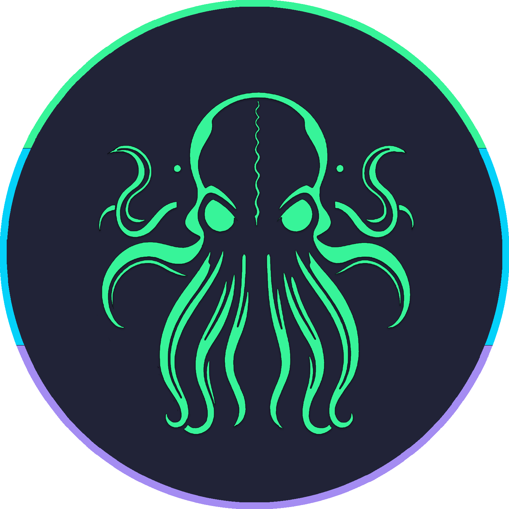
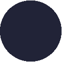
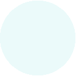
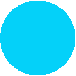
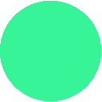
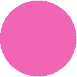
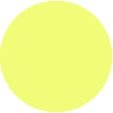

<h3 align="center">
 <br/>
 
 Eldritch Theme
 
</h3>

<h6 align="center">
  <a href="https://github.com/eldritch-theme/eldritch?tab=readme-ov-file#-palette">Palette</a>
  ·
  <a href="https://github.com/eldritch-theme/eldritch?tab=readme-ov-file#-ports">Ports</a>
  ·
  <a href="https://github.com/eldritch-theme/eldritch?tab=readme-ov-file#wallpapers">Wallpapers</a>
  ·
  <a href="https://github.com/eldritch-theme/eldritch?tab=readme-ov-file#contributing">Contributing</a>
</h6>

<p>
Eldritch is a community-driven dark theme inspired by Lovecraftian horror. With tones from the dark abyss and an emphasis on green and blue, it caters to those who appreciate the darker side of life.
</p>

<p align="center">
<a href="https://github.com/eldritch-theme/eldritch/stargazers"></a>
<a href="https://github.com/search?o=desc&q=org%3Aeldritch-theme&s=created&type=Issues"></a>   <br/>
<a href="https://discord.gg/ZJHEEHUAju"></a>
</p>

<p>
This repo serves as a repository for all the links to Eldritch theme ports as well as the general documentation and contribution guidelines. The theme is available for a variety of applications and is constantly being updated, expanded, and improved.
</p>

### 🎨 Palette

<table>
  <tr>
    <th>&nbsp;&nbsp;&nbsp;</th>
    <th>Labels</th>
    <th>Descriptor</th>
    <th>Hex</th>
    <th>RGB</th>
    <th>HSL</th>
    <th>CMYK</th>
    <th>Ansi16</th>
    <th>Ansi256</th>
  </tr>
  <tr>
    <td></td>
    <td>Sunken Depths Grey</td>
    <td>Background</td>
    <td><code>#212337</code></td>
    <td><code>rgb(33, 35, 55)</code></td>
    <td><code>hsl(234.55 deg, 25%, 17.25%)</code></td>
    <td><code>cmyk(40, 36, 0, 78)</code></td>
    <td><code>0</code></td>
    <td><code>236</code>
  </tr>
  <tr>
    <td></td>
    <td>Shallow Depths Grey</td>
    <td>Current Line</td>
    <td><code>#323449</code></td>
    <td><code>rgb(50, 52, 73)</code></td>
    <td><code>hsl(234.78 deg, 18.7%, 24.12%)</code></td>
    <td><code>cmyk(32, 42, 0, 5)</code></td>
    <td><code>8</code></td>
    <td><code>59</code>
  </tr>
  <tr>
    <td></td>
    <td>Lighthouse White</td>
    <td>Foreground</td>
    <td><code>#ebfafa</code></td>
    <td><code>rgb(235, 250, 250)</code></td>
    <td><code>hsl(180 deg, 60%, 95.1%)</code></td>
    <td><code>cmyk(6, 0, 0, 2)</code></td>
    <td><code>15</code></td>
    <td><code>231</code>
  </tr>
  <tr>
    <td></td>
    <td>The Old One Purple</td>
    <td>Comment</td>
    <td><code>#7081d0</code></td>
    <td><code>rgb(112, 129, 208)</code></td>
    <td><code>hsl(229.38 deg, 50.53%, 62.75%)</code></td>
    <td><code>cmyk(46, 38, 0, 18)</code></td>
    <td><code>4</code></td>
    <td><code>105</code></td>
  </tr>
  <tr>
    <td></td>
    <td>Watery Tomb Blue</td>
    <td>Secondary (Cyan)</td>
    <td><code>#04d1f9</code></td>
    <td><code>rgb(4, 209, 249)</code></td>
    <td><code>hsl(189.8 deg, 96.84%, 49.61%)</code></td>
    <td><code>cmyk(98, 16, 0, 2)</code></td>
    <td><code>14</code></td>
    <td><code>81</code>
  </tr>
  <tr>
    <td></td>
    <td>Great Old One Green</td>
    <td>Primary (Green)</td>
    <td><code>#37f499</code></td>
    <td><code>rgb(55, 244, 153)</code></td>
    <td><code>hsl(151.11 deg, 89.57%, 58.63%)</code></td>
    <td><code>cmyk(40, 36, 0, 78)</code></td>
    <td><code>10</code></td>
    <td><code>120</code>
  </tr>
  <tr>
    <td></td>
    <td>Dreaming Orange</td>
    <td>Orange</td>
    <td><code>#f7c67f</code></td>
    <td><code>rgb(247, 198, 127)</code></td>
    <td><code>hsl(35.5 deg, 88.24%, 73.33%)</code></td>
    <td><code>cmyk(0, 20, 49, 3)</code></td>
    <td><code>11</code></td>
    <td><code>222</code></td>
  </tr>
  <tr>
    <td></td>
    <td>Pustule Pink</td>
    <td>Pink</td>
    <td><code>#f265b5</code></td>
    <td><code>rgb(242, 101, 181)</code></td>
    <td><code>hsl(325.96 deg, 84.43%, 67.25%)</code></td>
    <td><code>cmyk(0, 58, 25, 5)</code></td>
    <td><code>13</code></td>
    <td><code>205</code></td>
  </tr>
  <tr>
    <td></td>
    <td>Lovecraft Purple</td>
    <td>Purple (Accent)</td>
    <td><code>#a48cf2</code></td>
    <td><code>rgb(164,140,242)</code></td>
    <td><code>hsl(254.12 deg, 79.69%, 74.9%)</code></td>
    <td><code>cmyk(32,42,0,5)</code></td>
    <td><code>5</code></td>
    <td><code>63</code></td>
  </tr>
  <tr>
    <td></td>
    <td>R'lyeh' Red</td>
    <td>Red (Error)</td>
    <td><code>#f16c75</code></td>
    <td><code>rgb(241, 108, 117)</code></td>
    <td><code>hsl(355.94 deg, 82.61%, 68.43%)</code></td>
    <td><code>cmyk(0,55,51,5)</code></td>
    <td><code>9</code></td>
    <td><code>203</code></td>
  </tr>
  <tr>
    <td></td>
    <td>Gold of Yuggoth</td>
    <td>Yellow</td>
    <td><code>#f1fc79</code></td>
    <td><code>rgb(241, 252, 121)</code></td>
    <td><code>hsl(65.04 deg, 95.62%, 73.14%)</code></td>
    <td><code>cmyk(4, 0, 52, 1)</code></td>
    <td><code>11</code></td>
    <td><code>227</code></td>
  </tr>
</table>

### 🧵 Ports

<details>
  <summary>🗒️ IDEs</summary>
  &nbsp;
  <table>
    <tr>
      <th>Application</th>
      <th>Theme Repository</th>
    </tr>
    <tr>
      <td><a href="https://code.visualstudio.com">Visual Studio Code</a></td>
      <td><a href="https://github.com/eldritch-theme/vscode">vscode</a></td>
      <td>A highly popular Electron based IDE by Microsoft</td>
    </tr>
    <tr>
      <td><a href="https://neovim.io">NeoVim</a></td>
      <td><a href="https://github.com/eldritch-theme/eldritch.nvim">eldritch.nvim</a></td>
      <td>NeoVim is a hyperextensible Vim-based text editor</td>
    </tr>
  </table>
</details>

<details>
  <summary>🖥️ Terminals</summary>
  &nbsp;
  <table>
    <tr>
      <th>Application</th>
      <th>Theme Repository</th>
      <th>Description</th>
    </tr>
  <tr>
      <td><a href="https://github.com/microsoft/terminal">Windows Terminal</a></td>
      <td><a href="https://github.com/eldritch-theme/windows-terminal">windows-terminal</a></td>
      <td>The Windows Terminal is a modern, fast, efficient, powerful, and productive terminal application for users of command-line tools and shells
    </td>
    </tr>
    <tr>
      <td><a href="https://wezfurlong.org/wezterm/index.html">Wezterm</a></td>
      <td><a href="https://github.com/eldritch-theme/wezterm">wezterm</a></td>
      <td>WezTerm is a powerful cross-platform terminal emulator and multiplexer written by @wez and implemented in Rust
      </td>
    </tr>
    <tr>
      <td><a href="https://sw.kovidgoyal.net/kitty/">Kitty</a></td>
      <td><a href="https://github.com/eldritch-theme/kitty">kitty</a></td>
      <td>The fast, feature-rich, GPU based terminal emulator</td>
    </tr>
    <tr>
      <td><a href="https://ghostty.org/">Ghostty</a></td>
      <td><a href="https://github.com/eldritch-theme/ghostty">ghostty</a></td>
      <td>Ghostty is a fast, feature-rich, and cross-platform terminal emulator that uses platform-native UI and GPU acceleration.</td>
    </tr>
    <tr>
      <td><a href="https://warp.dev">Warp</a></td>
      <td><a href="https://github.com/eldritch-theme/warp">warp</a></td>
      <td>Warp is the terminal reimagined with AI and collaborative tools for better productivity</td>
    </tr>
    <tr>
      <td><a href="https://iterm2.com">iTerm2</a></td>
      <td><a href="https://github.com/eldritch-theme/iterm2">iTerm2</a></td>
      <td>iTerm2 is a replacement for Terminal and the successor to iTerm. It works on Macs with macOS 10.14 or newer. iTerm2 brings the terminal into the modern age with features you never knew you always wanted.</td>
    </tr>
    <tr>
      <td><a href="https://github.com/alacritty/alacritty">Alacritty</a></td>
      <td><a href="https://github.com/eldritch-theme/alacritty">Alacritty</a></td>
      <td>Alacritty - A fast, cross-platform, OpenGL terminal emulator.</td>
    </tr>
    <tr>
      <td><a href="https://termux.dev">Termux</a></td>
      <td><a href="https://github.com/system32149/eldritch-termux">eldritch-termux</a></td>
      <td>Termux is a terminal emulator and GNU/Linux environment application for Android OS.</td>
     </tr>
  </table>
</details>

<details>
  <summary>🌐 Browsers</summary>
  &nbsp;
  <table>
    <tr>
      <th>Application</th>
      <th>Theme Repository</th>
      <th>Description</th>
    </tr>
    <tr>
      <td><a href="https://vivaldi.com">Vivaldi</a></td>
      <td><a href="https://github.com/eldritch-theme/vivaldi">vivaldi</a></td>
      <td>A Chromium based browser focused on security and high levels of customization.</td>
    </tr>
    <tr>
      <td><a href="https://www.mozilla.org/en-US/firefox/">Firefox</a></td>
      <td><a href="https://github.com/eldritch-theme/firefox">firefox</a></td>
      <td>No shady privacy policies or back doors for advertisers. Just a lightning fast browser that doesn’t sell you out.</td>
    </tr>
    <tr>
      <td><a href="https://zen-browser.app/">Zen</a></td>
      <td><a href="https://github.com/eldritch-theme/zen">zen</a></td>
      <td>Firefox based browser with a focus on privacy and customization.</td>
    </tr>
  </table>
  🙊 UserJS scripts & Browser Extensions
  <table>
    <tr>
      <th>Site</th>
      <th>Theme Repository</th>
      <th>Description</th>
    </tr>
    <tr>
      <td><a href="https://duckduckgo.com">DuckDuckGo</a></td>
      <td><a href="https://github.com/eldritch-theme/duckduckgo">duckduckgo</a></td>
      <td>A search engine focused on privacy</td>
    </tr>
    <tr>
      <td><a href="https://github.com/tridactyl/tridactyl">Tridactyl</a></td>
      <td><a href="https://github.com/eldritch-theme/tridactyl">tridactyl</a></td>
      <td>Replace Firefox's default control mechanism with one modelled on the one true editor, Vim.</td>
    </tr>
  </table>
</details>

<details>
  <summary>🗒️ Note Taking</summary>
  &nbsp;
  <table>
    <tr>
      <th>Application</th>
      <th>Theme Repository</th>
      <th>Description</th>
    </tr>
    <tr>
      <td><a href="https://obsidian.md">Obsidian</a></td>
      <td><a href="https://github.com/eldritch-theme/obsidian">obsidian</a></td>
      <td>Obsidian is the private and flexible writing app that adapts to the way you think.</td>
    </tr>
  </table>
</details>

<details>
  <summary>🐚 Shell & CLI Applications</summary>
  &nbsp;
  <table>
    <tr>
      <th>Application</th>
      <th>Theme Repository</th>
      <th>Description</th>
    </tr>
    <tr>
      <td><a href="https://fishshell.com">Fish Shell</a></td>
      <td><a href="https://github.com/eldritch-theme/fish">fish</a></td>
      <td>The user-friendly command line shell.</td>
    <tr>
      <td><a href="https://github.com/sindresorhus/pure">Pure Prompt</a></td>
      <td><a href="https://github.com/eldritch-theme/pure-prompt">pure-prompt</a></td>
      <td>Pure ZSH prompt</td>
    </tr>
    <tr>
      <td><a href="https://spaceship-prompt.sh">Spaceship Prompt</a></td>
      <td><a href="https://github.com/eldritch-theme/spaceship">spaceship</a></td>
      <td>Minimalistic, powerful and extremely customizable Zsh prompt</td>
    </tr>
    <tr>
      <td><a href="https://github.com/junegunn/fzf">FZF</a></td>
      <td><a href="https://github.com/eldritch-theme/fzf">fzf</a></td>
      <td>Fuzzy Finder</td>
    </tr>
    <tr>
      <td><a href="https://github.com/sharkdp/bat">Bat</a></td>
      <td><a href="https://github.com/eldritch-theme/bat">bat</a></td>
      <td>A cat clone with syntax highlighting and git integration</td>
    </tr>
    <tr>
      <td><a href="https://github.com/lsd-rs/lsd">LSD</a></td>
      <td><a href="https://github.com/eldritch-theme/lsd">lsd</a></td>
      <td>A rewrite of GNU ls with lots of added features like colors, icons, tree-view, more formatting options etc.
      </td>
    </tr>
    <tr>
      <td><a href="https://github.com/aristocratos/btop">btop</a></td>
      <td><a href="https://github.com/eldritch-theme/btop">btop</a></td>
      <td>Resource monitor that shows usage and stats for processor, memory, disks, network and processes</td>
    </tr>
    <tr>
      <td><a href="https://github.com/dylanaraps/neofetch">neofetch</a></td>
      <td><a href="https://github.com/eldritch-theme/neofetch">neofetch</a></td>
      <td>Neofetch displays information about your operating system, software and hardware in an aesthetic and visually
        pleasing way.<strong>This repo has been archived. Recommend using fastfetch</strong></td>
    </tr>
    <tr>
      <td><a href="https://github.com/fastfetch-cli/fastfetch">fastfetch</a></td>
      <td><a href="https://github.com/eldritch-theme/fastfetch">fastfetch</a></td>
      <td>Fastfetch is a neofetch-like tool for fetching system information and displaying them in a pretty way. It is written mainly in C, with performance and customizability in mind.</td>
    </tr>
  </table>
</details>

<details>
  <summary>🥾 Boot Managers / Loaders</summary>
  &nbsp;
  <table>
    <tr>
      <th>Application</th>
      <th>Theme Repository</th>
    </tr>
    <tr>
      <td><a href="https://sourceforge.net/projects/refind/">rEFInd</a></td>
      <td><a href="https://github.com/eldritch-theme/refind">refind</a></td>
      <td>rEFInd is a popular boot manager for UEFI and EFI based machines. It is a fork of the no longer maintained, <a href="http://refit.sourceforge.net/">rEFIt</a> boot manager.</td>
    </tr>
  </table>
</details>

<details>
  <summary>💬 Communication</summary>
  &nbsp;
  <table>
    <tr>
      <th>Application</th>
      <th>Theme Repository</th>
      <th>Description</th>
    </tr>
    <tr>
      <td><a href="https://slack.com">Slack</a></td>
      <td><a href="https://github.com/eldritch-theme/slack">slack</a></td>
      <td>Slack is a messaging app for business that connects people to the information they need.</td>
    </tr>
    <tr>
      <td><a href="https://betterdiscord.app">BetterDiscord</a></td>
      <td><a href="https://github.com/eldritch-theme/betterdiscord">betterdiscord</a></td>
      <td>BetterDiscord extends the functionality of DiscordApp by enhancing it with new features.</td>
    </tr>
  </table>
</details>

<details>
  <summary>🎧 Music</summary>
  &nbsp;
  <table>
    <tr>
      <th>Application</th>
      <th>Theme Repository</th>
      <th>Description</th>
    </tr>
    <tr>
      <td><a href="https://spicetify.app">Spicetify</a></td>
      <td><a href="https://github.com/eldritch-theme/spicetify">spicetify</a></td>
      <td>Powerful CLI tool to take control of the Spotify client.</td>
    </tr>
    <tr>
      <td><a href="http://kagi.com">Kagi</a></td>
      <td><a href="https://github.com/eldritch-theme/kagi">kagi</a></td>
      <td>Kagi is a paid service because we want to show you high quality, unbiased search results that are in your best interest.</td>
    </tr>
  </table>
</details>

<details>
  <summary>🤷 Misc</summary>
  &nbsp;
  <table>
    <tr>
      <th>Application</th>
      <th>Theme Repository</th>
      <th>Description</th>
    </tr>
    <tr>
      <td><a href="https://github.com/anuraghazra/github-readme-stats">GitHub Readme Stats</a></td>
      <td><a href="https://github.com/eldritch-theme/github-readme-stats">github-readme-stats</a></td>
      <td>GitHub stat badges for your profile README.</td>
    </tr>
   <tr>
   <td><a href="https://hyprpanel.com">Hyprpanel</a></td>
      <td><a href="https://github.com/DWarez/eldritch-hyprpanel">DWarez/eldritch-hyprpanel</a></td>
      <td>Hyprpanel theme</td>
   </tr>
   <tr>
   <td><a href="https://github.com/abenz1267/walker">Walker</a></td>
      <td><a href="https://github.com/eldritch-theme/walker">walker</a></td>
      <td>Walker is a highly extendable application launcher that doesn't hold back on features and usability. Fast. Unclutters your brain. Improves your workflow.</td>
   </tr>
  </table>
</details>

### Wallpapers

- Wallpapers can be found under the [wallpaper](https://github.com/eldritch-theme/eldritch/tree/master/wallpaper) directory.
- If you're using [Wallpaper Engine](https://www.wallpaperengine.io/en) we have a theme for that too [here](https://steamcommunity.com/sharedfiles/filedetails/?id=3209391257)!
  - Only supports 3440x1440 but if you'd like a different resolution let me know and I can work on it.

### Contributing

1. Clone [template repo](https://github.com/eldritch-theme/eldritch-repo-template).

```
git clone https://github.com/eldritch-theme/eldritch-repo-template your-port-name
cd your-port-name && rm -rf .git
```

2. Add anything you need, replacing things in README.md as needed.
3. Be sure to checkout the [SPEC.md](https://github.com/eldritch-theme/eldritch/blob/master/SPEC.md) for more info on color usage.
4. You can choose to either host the repo on your own account or you can request to be a contributor to the [eldritch-theme](https://github.com/eldritch-theme) and I will approve you so you can maintain the repo along with other under the organization account.
5. Create a pull request to update README.md in this repo to link to the newly created repo.
