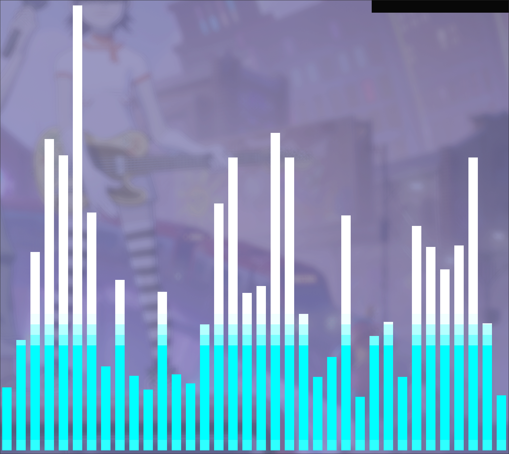

<!-- DO NOT CHANGE THIS -->
<p align="center">

</p>
<p>
Eldritch is a community-driven dark theme inspired by Lovecraftian horror. With tones from the dark abyss and an emphasis on green and blue, it caters to those who appreciate the darker side of life.
</p>

Main Theme repo can be found [here](https://github.com/eldritch-theme/eldritch)

### Showcase
<!-- Your screenshot should go here -->
<br/>

### Installation
1. Copy eldritch.cava to ~/.config/cava/themes/eldritch.cava
2. Change ~/.config/cava/config line from:
```
; theme =
```
to
```
theme="eldritch.cava"
```

<!-- If you want to provide install from source options, you can use the following template: -->
<!-- ### Installation From Source -->
<!-- 1. Any instructions here -->
