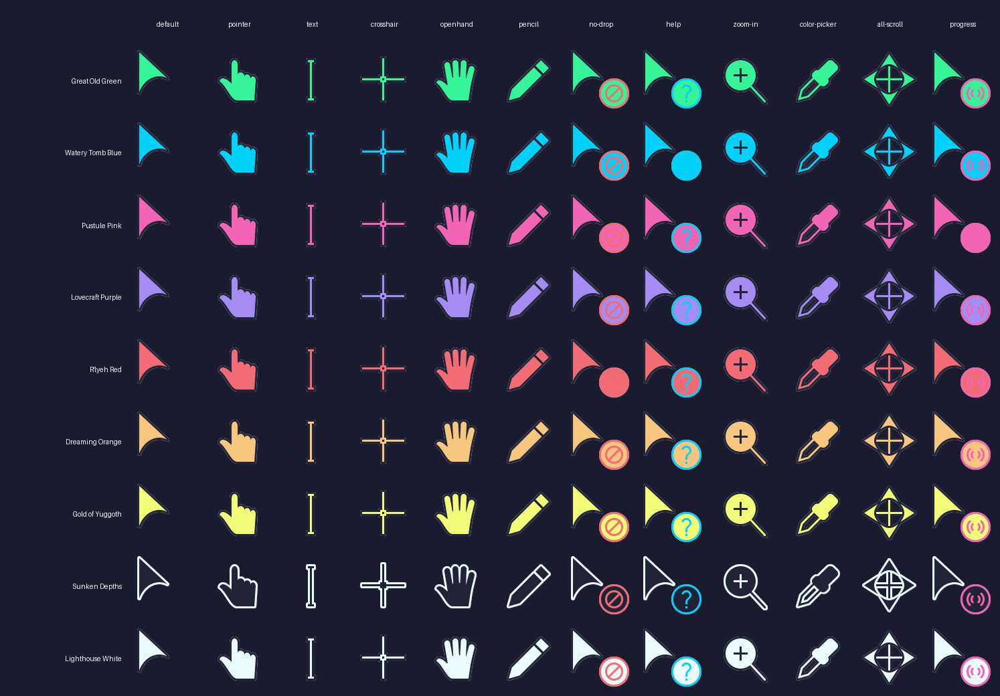

<p align="center">
  
</p>
<p>
  Eldritch is a community-driven dark theme inspired by Lovecraftian horror. With tones from the dark abyss and an emphasis on green and blue, it caters to those who appreciate the darker side of life.
</p>

Main Theme repo can be found [here](https://github.com/eldritch-theme/eldritch)

### Showcase
<!-- Your screenshots should go here -->

## Variants



| Accent | Nix attribute | Color |
|---|---|---|
| Great Old One Green | `great-old-green` | `#37f499` |
| Watery Tomb Blue | `watery-tomb-blue` | `#04d1f9` |
| Pustule Pink | `pustule-pink` | `#f265b5` |
| Lovecraft Purple | `lovecraft-purple` | `#a48cf2` |
| R'lyeh Red | `rlyeh-red` | `#f16c75` |
| Dreaming Orange | `dreaming-orange` | `#f7c67f` |
| Gold of Yuggoth | `gold-of-yuggoth` | `#f1fc79` |
| Sunken Depths | `sunken-depths` | `#212337` |
| Lighthouse White | `lighthouse-white` | `#ebfafa` |

## Installation

### GitHub Release

1. Download your preferred variant from the [latest release](https://github.com/eldritch-theme/cursors/releases/latest).
2. Extract the zip to `$HOME/.local/share/icons` or `$HOME/.icons`.
3. Select the theme in your desktop environment settings.

### Nix (TBD, need to submit to nixpkgs)

```nix
# TBD, not submitted to nixpkgs yet, use overlay or input for now
# All variants
pkgs.eldritch-cursors

# Single variant
pkgs.eldritch-cursors.great-old-green
```

Build directly from the flake:

```bash
nix build github:eldritch-theme/cursors#great-old-green

```

#### NixOS module

```nix
{ pkgs, ... }: {
  environment.systemPackages = [ pkgs.eldritch-cursors ]; # (TBD when submitted to nixpkgs, for now use overlay or input)

  environment.variables.XCURSOR_THEME = "Eldritch Cthulhu Great Old Green";
  #or nixos.stylix (if using stylix)->
  #   cursor = {
  #   name = "Eldritch Cthulhu Great Old Green";
  #   package = inputs.eldritch-cursors.packages.${pkgs.system}.great-old-green;
  #   size = 32;
  # };

}
```

#### Cachix Cache

Feel free to use my cachix cache so you don't have to build from source.

```nix
          trusted-substituters = [
            ...
            "https://neonvoidx.cachix.org"
          ];
          trusted-public-keys = [
            "neonvoidx.cachix.org-1:nHFGhvzWqULuNWFbuPwTP0eUW+k7utl0chxXhUJhU1Y="
          ];

```

### Manual build

Requirements: `python3`, `inkscape`, `xcursorgen`, `zip`.

```bash
git clone https://github.com/eldritch-theme/cursors.git
cd cursors

# Build all variants
./build -p palettes/eldritch-cthulhu.json

# Build specific accent
./build -p palettes/eldritch-cthulhu.json -a 'great-old-green'
```

Or with `just`:

```bash
just build  # all variants
just single great-old-green  # single accent
```

## Acknowledgments

- [varlesh](https://github.com/varlesh/volantes-cursors) for the original Volantes Cursors.
- [catppuccin/cursors](https://github.com/catppuccin/cursors) for the approach this project is based on.

## License

GPL-3.0-only
