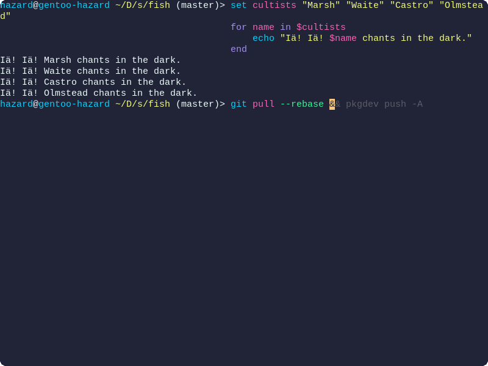
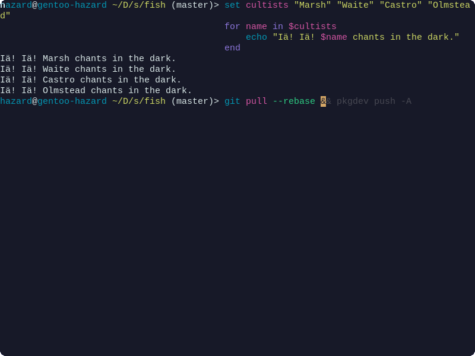
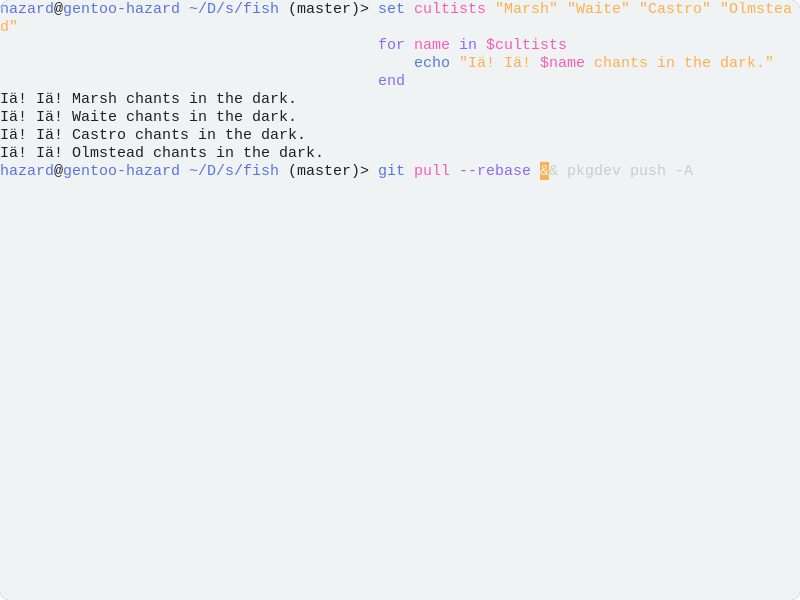

<!-- DO NOT CHANGE THIS -->
<p align="center">

</p>
<p>
Eldritch is a community-driven dark theme inspired by Lovecraftian horror. With tones from the dark abyss and an emphasis on green and blue, it caters to those who appreciate the darker side of life.
</p>

Main Theme repo can be found [here](https://github.com/eldritch-theme/eldritch)

### Showcase

<details>
    <summary>🦑 Cthulhu (Default)</summary>
    
</details>
<details>
    <summary>🌀 Abyss (Darker)</summary>
    
</details>
<details>
    <summary>🌅 Dusk (Light)</summary>
    
</details>

### Installation

1. Download your preferred palette's configuration from [themes](themes/) into `~/.config/fish/themes` or install using [fisher](https://github.com/jorgebucaran/fisher)
   ```sh
   fisher install eldritch-theme/fish
   ```
2. Set your fish theme to your chosen theme in `~/.config/fish/config.fish`:
   ```sh
   fish_config theme choose eldritch-cthulhu                      # Cthulhu
   fish_config theme choose eldritch-abyss                        # Abyss
   fish_config theme choose eldritch-cthulhu --color-theme=light  # Dusk
   ```
