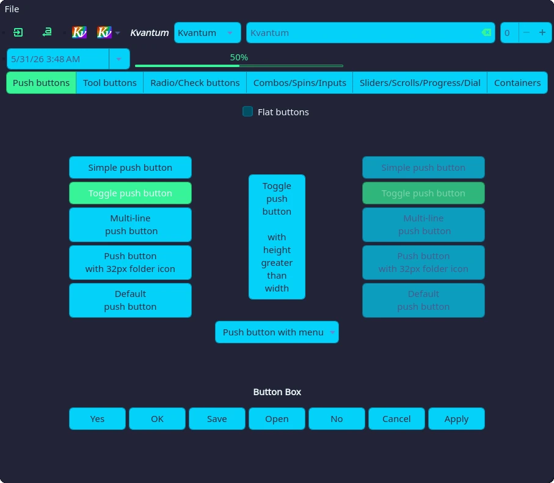
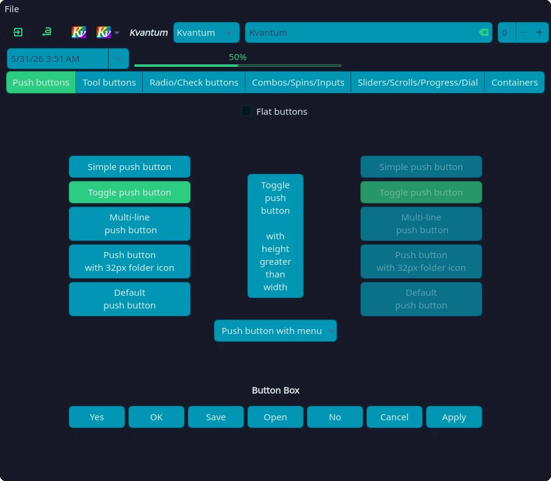
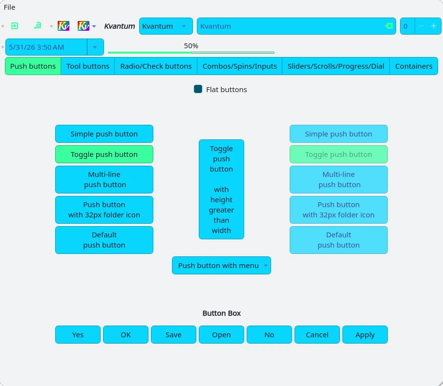

<!-- DO NOT CHANGE THIS -->
<p align="center">

</p>
<p>
Eldritch is a community-driven dark theme inspired by Lovecraftian horror. With tones from the dark abyss and an emphasis on green and blue, it caters to those who appreciate the darker side of life.
</p>

Main Theme repo can be found [here](https://github.com/eldritch-theme/eldritch)

### Showcase

<details>
    <summary>🦑 Cthulhu (Default)</summary>
    
</details>
<details>
    <summary>🌀 Abyss (Darker)</summary>
    
</details>
<details>
    <summary>🌅 Dusk (Light)</summary>
    
</details>

### Installation

1. Download the archive of your preferred palette from releases
2. Extract into `~/.config/Kvantum`
   ```sh
   aunpack Eldritch-* -X ~/.config/Kvantum
   ```
3. Open Kvantum Manager
4. Apply the theme
