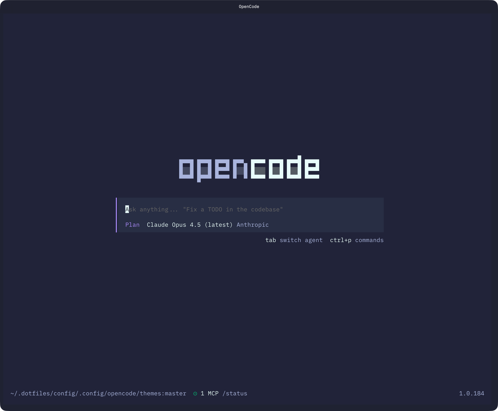
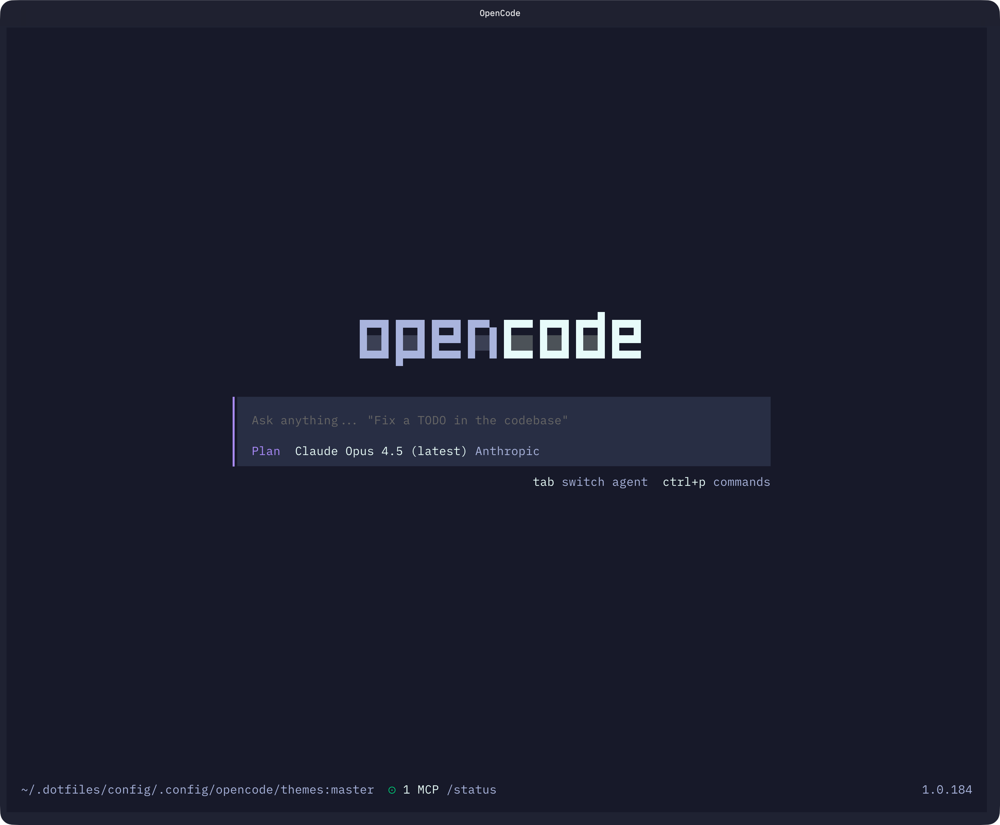
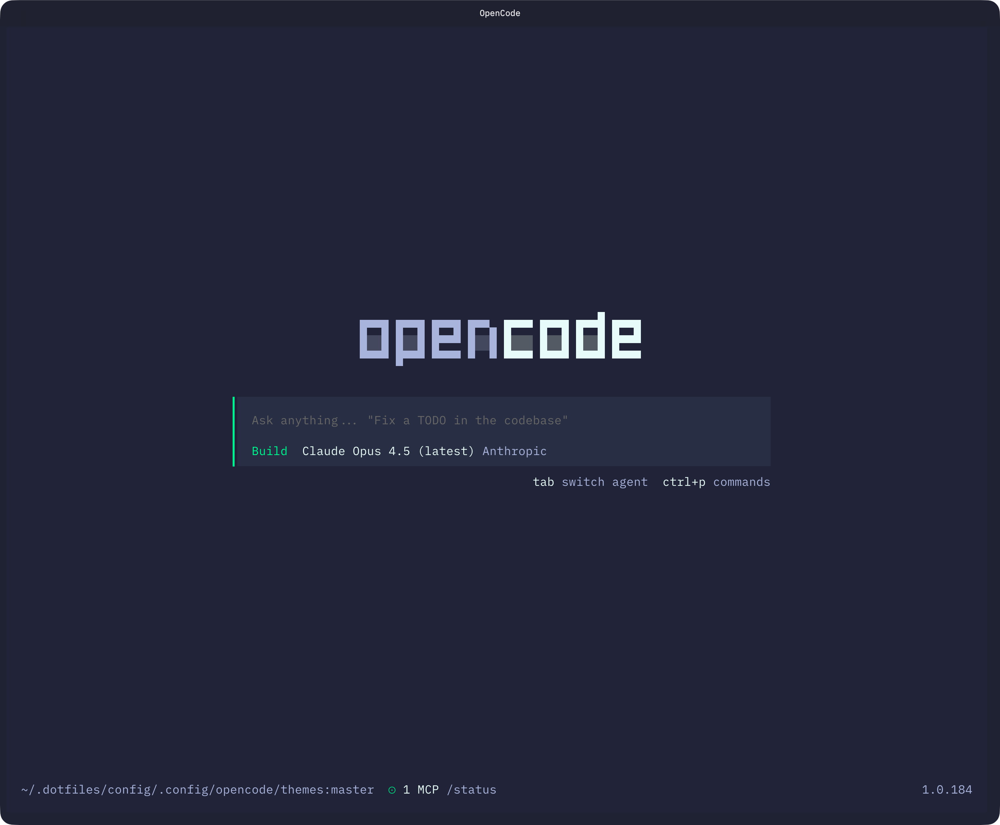
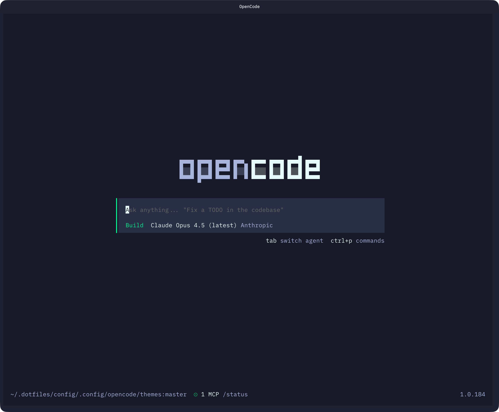
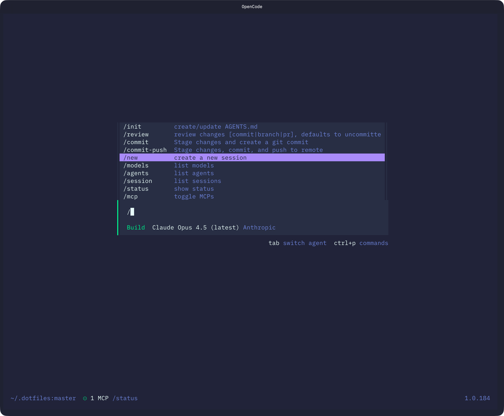
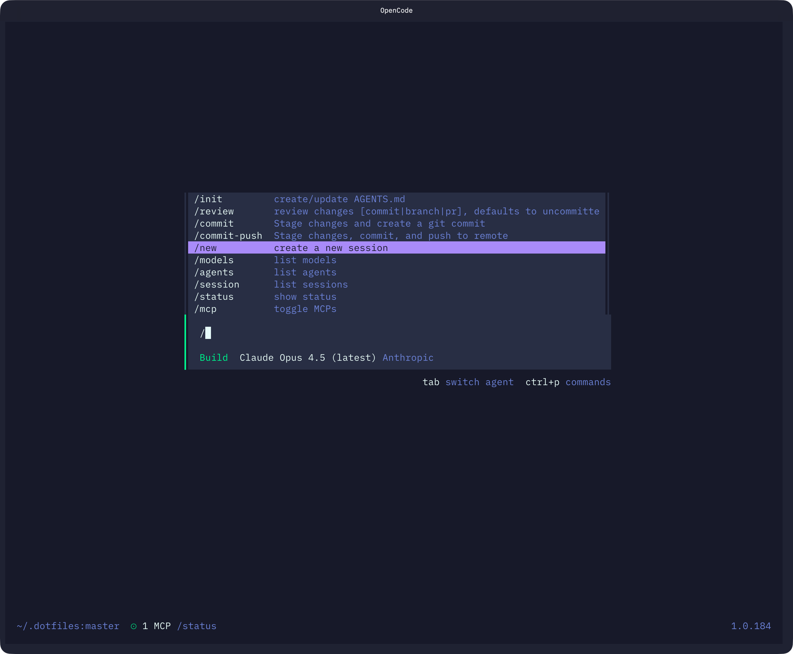
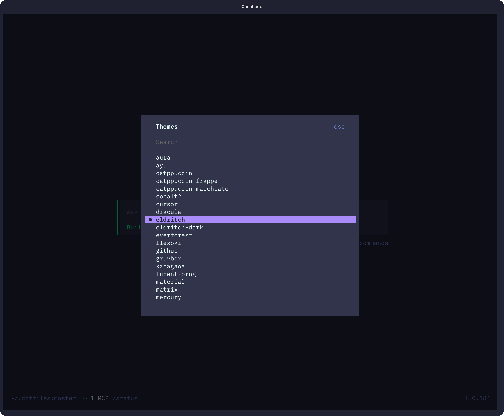
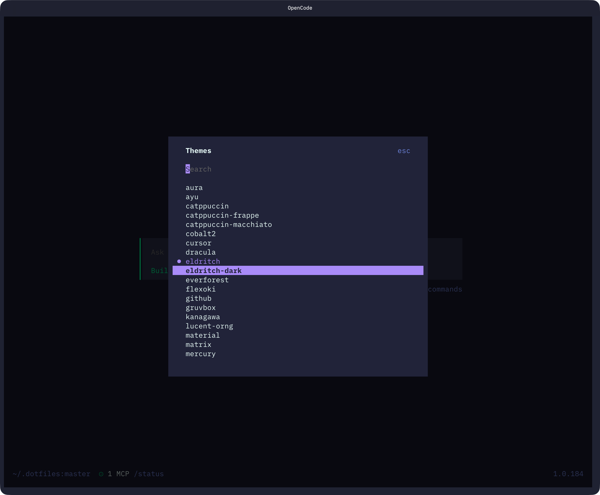
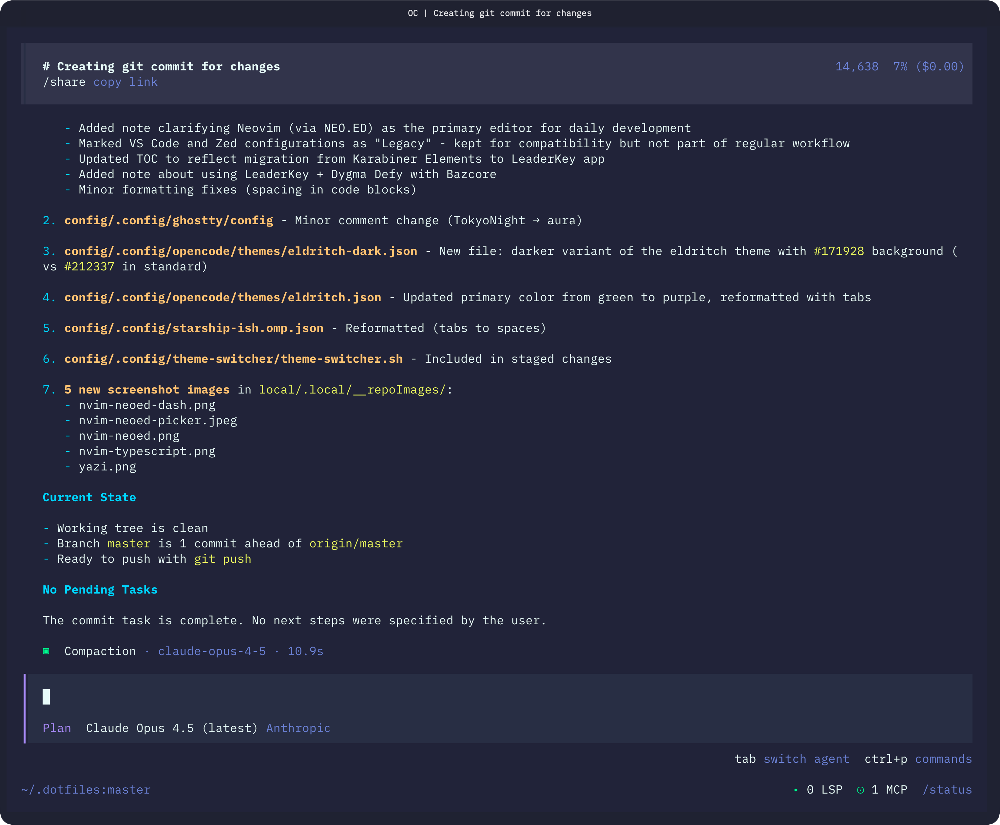
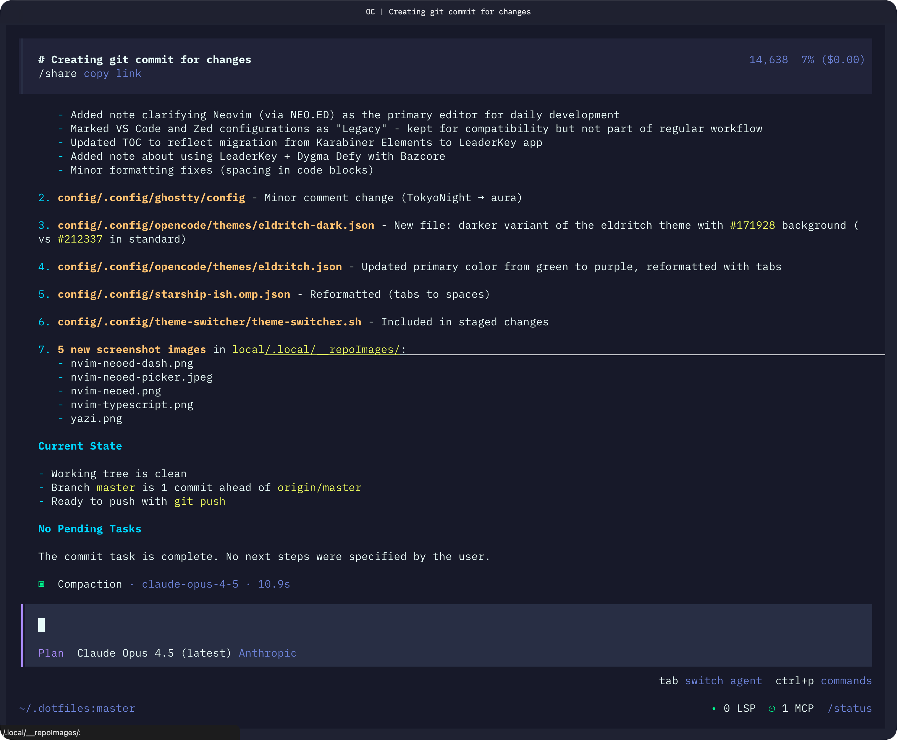

<!-- DO NOT CHANGE THIS -->
<p align="center">

</p>
<p>
Eldritch is a community-driven dark theme inspired by Lovecraftian horror. With tones from the dark abyss and an emphasis on green and blue, it caters to those who appreciate the darker side of life.
</p>

Main Theme repo can be found [here](https://github.com/eldritch-theme/eldritch)

### Showcase

|                    Eldritch                     |                        Eldritch-Dark                         |
| :---------------------------------------------: | :----------------------------------------------------------: |
|      |      |
|  |  |
|                 |                 |
|           |           |
|           |           |

### Installation

1. Clone the repository directly into your OpenCode themes directory:

   ```bash
   git clone https://github.com/edheltzel/eldritch-opencode.git
   cd eldritch-opencode/themes && cp *.json ~/.config/opencode/themes
   ```

2. Select the theme using the `/theme` command in OpenCode, or add it to your `opencode.json` config:
   ```json
   {
     "$schema": "https://opencode.ai/config.json",
     "theme": "eldritch"
   }
   ```

Available themes:

- `eldritch` - Dark terminal background variant
- `eldritch-dark` - Darker terminal background variant
