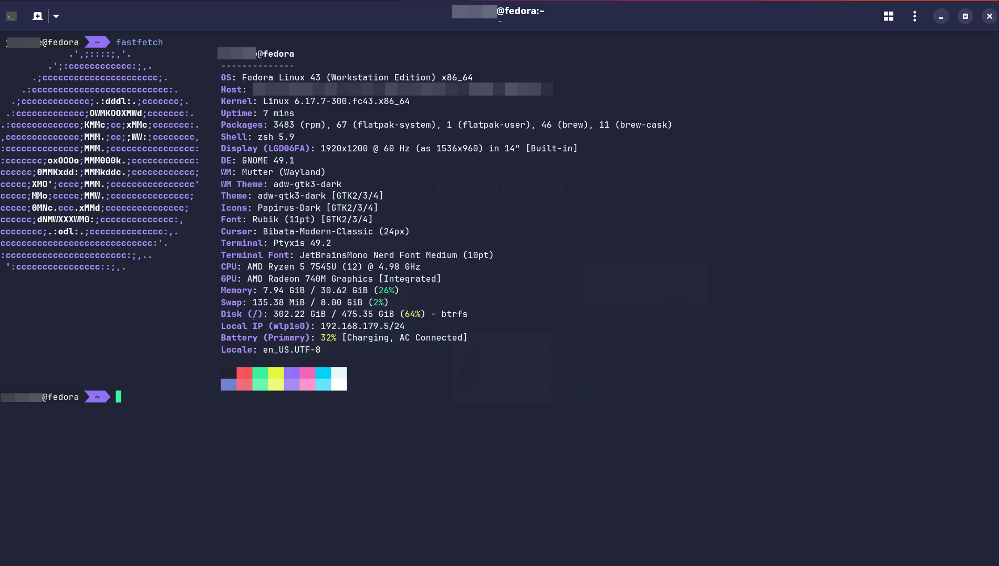
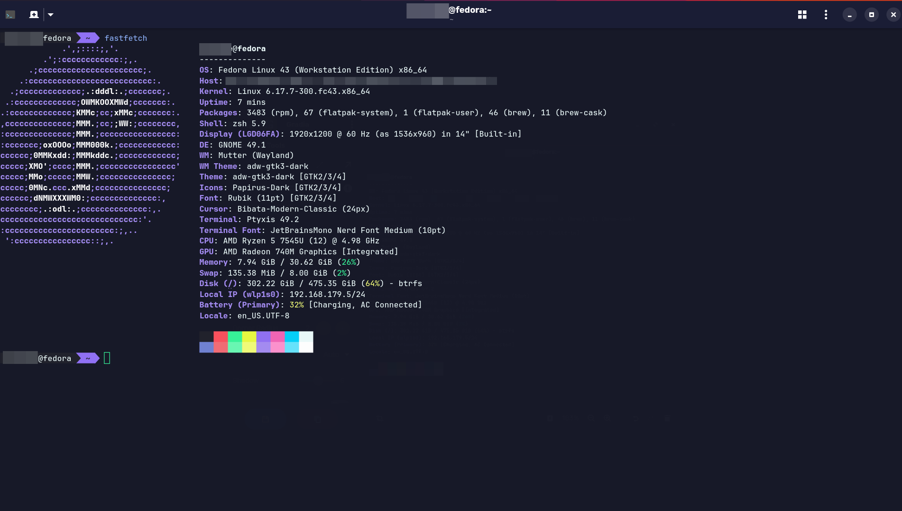

<!-- DO NOT CHANGE THIS -->

Eldritch is a community-driven dark theme inspired by Lovecraftian horror. With tones from the dark abyss and an emphasis on green and blue, it caters to those who appreciate the darker side of life.

Main Theme repo can be found [here](https://github.com/eldritch-theme/eldritch)

### Showcase
<!-- Your screenshot should go here -->
 
 

### Installation

1. Download the Eldritch.palette or Eldritch-dark.palette from this repository.
2. Place in your ptyxis theme folder $XDG_USER_DATA_DIR/org.gnome.Ptyxis(.Devel)/palettes or drag-and-drop the .palette file to install it automatically
3. Select Eldritch or Eldritch Dark from the settings menu.