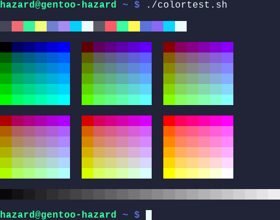
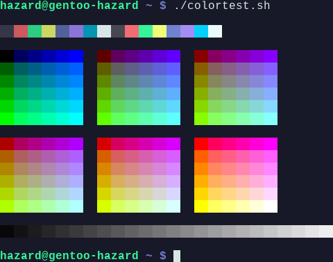
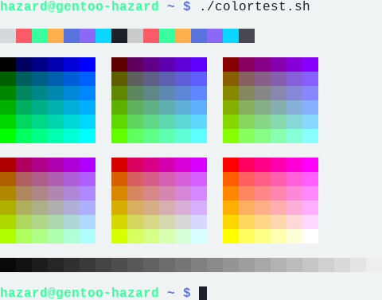

<!-- DO NOT CHANGE THIS -->

  

  Eldritch is a community-driven dark theme inspired by Lovecraftian horror. With tones from the dark abyss and an emphasis on green and blue, it caters to those who appreciate the darker side of life.

Main Theme repo can be found [here](https://github.com/eldritch-theme/eldritch)

### Showcase

<!-- Your screenshots should go here -->

    
🦑 Cthulhu (Default)

    

    
🌀 Abyss (Darker)

    

    
🌅 Dusk (Light)

    

### Installation

1. Download your preferred variant from [themes](themes) and copy into the `/usr/share/qtermwidget6/color-schemes` directory
2. Open QTerminal and go to **File** > **Preferences** > **Appearance** > **Color scheme**
3. Choose your preferred variant from the dropdown and click **Apply**
